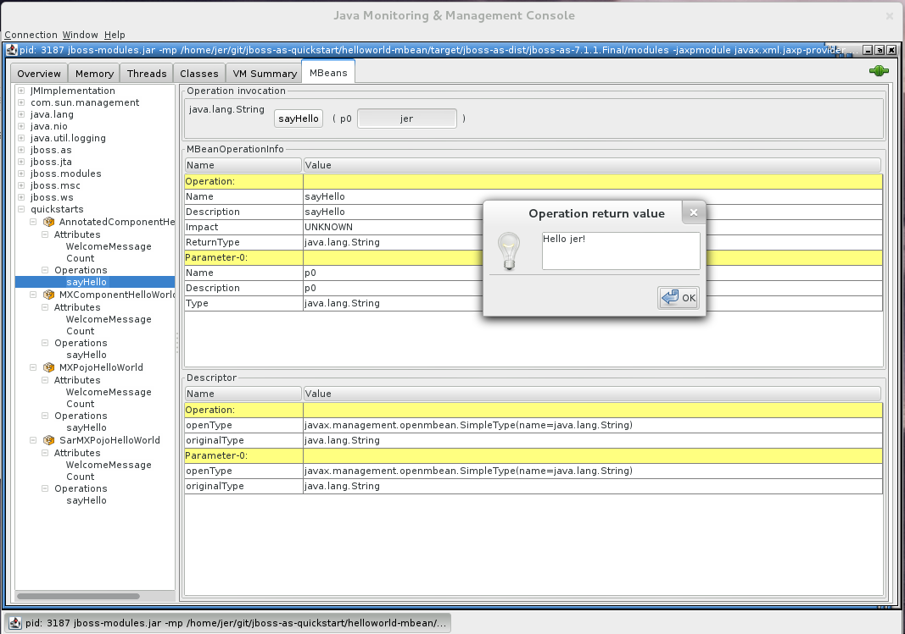

helloworld-mbean: Helloworld Using MBean and CDI component
======================================================
Author: Lagarde Jeremie  
Level: Intermediate  
Technologies: CDI, JMX, MBean  
Summary: The `helloworld-mbean` quickstart demonstrates the use of *CDI 1.0* and *MBean* in JBoss EAP and includes JConsole instructions and Arquillian tests.  
Target Product: JBoss EAP  
Source: <https://github.com/jboss-developer/jboss-eap-quickstarts/>  

What is it?
-----------

The `helloworld-mbean` quickstart demonstrates the use of *CDI 1.0* and *MBean* in Red Hat JBoss Enterprise Application Platform. The project also includes a set of Arquillian tests for MBeans.

The example is composed of the following MBeans:

1. `AnnotatedComponentHelloWorld`: This MBean is a managed bean with '@MXBean' annotation.

1. `MXComponentHelloWorld`:  This MBean is a managed bean with 'MXBean' interface.

1. `MXPojoHelloWorld`:  This MBean is a pojo using MXBean interface and declared in the `jboss-service.xml` file.

1. `SarMXPojoHelloWorld`:  This MBean is a pojo using MXBean interface and declared in jboss-service.xml in SAR packaging.

System requirements
-------------------

The application this project produces is designed to be run on Red Hat JBoss Enterprise Application Platform 6.1 or later. 

All you need to build this project is Java 6.0 (Java SDK 1.6) or later, Maven 3.0 or later.

 
Configure Maven
---------------

If you have not yet done so, you must [Configure Maven](https://github.com/jboss-developer/jboss-developer-shared-resources/blob/master/guides/CONFIGURE_MAVEN.md#configure-maven-to-build-and-deploy-the-quickstarts) before testing the quickstarts.

Use of EAP_HOME
---------------

In the following instructions, replace `EAP_HOME` with the actual path to your JBoss EAP 6 installation. The installation path is described in detail here: [Use of EAP_HOME and JBOSS_HOME Variables](https://github.com/jboss-developer/jboss-developer-shared-resources/blob/master/guides/USE_OF_EAP_HOME.md#use-of-eap_home-and-jboss_home-variables).

Start the JBoss EAP Server
-------------------------

1. Open a command prompt and navigate to the root of the JBoss EAP directory.
2. The following shows the command line to start the server:

        For Linux:   EAP_HOME/bin/standalone.sh
        For Windows: EAP_HOME\bin\standalone.bat

 
Build and Deploy the Quickstart
-------------------------

_NOTE: The following build command assumes you have configured your Maven user settings. If you have not, you must include Maven setting arguments on the command line. See [Build and Deploy the Quickstarts](https://github.com/jboss-developer/jboss-developer-shared-resources/blob/master/guides/BUILD_AND_DEPLOY.md#build-and-deploy-the-quickstarts) for complete instructions and additional options._

1. Make sure you have started the JBoss EAP server as described above.
2. Open a command propmt and navigate to the root directory of this quickstart.
3. Type this command to build and deploy the archive:

        mvn clean jboss-as:deploy

4. This will deploy `helloworld-mbean-webapp\target\jboss-helloworld-mbean-helloworld-mbean-webapp.war` and `helloworld-mbean-service\target\jboss-helloworld-mbean-helloworld-mbean-service.sar` to the running instance of the server.

Access and Test the MBeans
--------------------------

This quickstart differs from the other quickstarts in that it uses 'JConsole' to access and test the quickstart rather than access an URL in the browser. If you do access <http://localhost:8080/jboss-helloworld-mbean-helloworld-mbean-webapp/>, you will see a screen shot image of the JConsole application,

The following sections describe how to use 'JConsole' to inspect and test the MBeans. 

Start JConsole
--------------

To connect to the JBoss EAP server using JConsole, open a command prompt and type the following command :

        For Linux:   JDK_HOME/bin/jconsole
        For Windows: JDK_HOME\bin\jconsole.exe

Select the local `org.jboss.modules.Main` process and click `Connect`.

A dialog displays with the warning "Secure connection failed. Retry insecurely?". Click `Insecure` to continue.

Test the MBeans in JConsole
---------------------------

You can use JConsole to inspect and use the MBeans :

1. Click on the MBeans tab.
2. Expand `quickstarts` in the left column of the console.
3. Under `quickstarts`, you see the 4 MBeans: `AnnotatedComponentHelloWorld`, `MXComponentHelloWorld`, `MXPojoHelloWorld`, and `SarMXPojoHelloWorld`
4. Expand each MBean and choose: `Operations` --> `sayHello`.
5. Type your name in the (p0 String ) input text box and click the `sayHello` button.
   * For the `AnnotatedComponentHelloWorld` and `MXComponentHelloWorld` examples, you will see a popup Window displaying `Hello <your name>!`.
   * For the `MXPojoHelloWorld` and `SarMXPojoHelloWorld` examples, you will see a popup Window displaying `Welcome <your name>!`.

Undeploy the Archive
--------------------

1. Make sure you have started the JBoss EAP server as described above.
2. Open a command prompt and navigate to the root directory of this quickstart.
3. When you are finished testing, type this command to undeploy the archive:

        mvn jboss-as:undeploy

Run the Quickstart in Red Hat JBoss Developer Studio or Eclipse
-------------------------------------
You can also start the server and deploy the quickstarts or run the Arquillian tests from Eclipse using JBoss tools. For general information about how to import a quickstart, add a JBoss EAP server, and build and deploy a quickstart, see [Use JBoss Developer Studio or Eclipse to Run the Quickstarts](https://github.com/jboss-developer/jboss-developer-shared-resources/blob/master/guides/USE_JBDS.md#use-jboss-developer-studio-or-eclipse-to-run-the-quickstarts) 

This quickstart consists of multiple projects and requires installation of the "JBoss Tools Maven Packaging Configurator", so it deploys and runs differently in JBoss Developer Studio than the other quickstarts.

1.  When you import the `helloworld-mbean` quickstart into JBoss Developer Studio, you see the following warnings for the `jboss-helloworld-mbean-webapp/src/main/webapp/META-INF/jboss-service.xml` and `/jboss-helloworld-mbean-service/src/main/resources/META-INF/jboss-service.xml` files:

        No grammar constraints (DTD or XML Schema) referenced in the document. 
    
   There is a known issue with the schema for the `jboss-service.xml` file that prevents successful validation. To prevent import errors, these files do not specify the schema location (http://www.jboss.org/schema/jbossas/jboss-service_7_0.xsd).
2. Install the JBoss Tools Maven Packaging Configurator
   * If the "JBoss Central" page is not showing, open it by choosing `Help` --> `JBoss Central`.
   * Click the `Software/Install` tab at the bottom of the `JBoss Central`.
   * Select the "JBoss Tools Maven Packaging Configurator" and click `Update/Install`.
3. Right click on the parent `jboss-helloworld-mbean` parent project and choose `Maven` --> `Update Project...`. Select all projects and click `OK`.
4. Right-click on the `helloworld-mbean-helloworld-mbean-service` project and choose `Run As` --> `Run on Server`. 
5. Right-click on the `helloworld-mbean-helloworld-mbean-webapp` project and choose `Run As` --> `Run on Server`. 
6. [Start JConsole](#start-jconsole) and [Test the MBeans in JConsole](#test-the-mbeans-in-jconsole) as described above.

Debug the Application
------------------------------------

If you want to debug the source code of any library in the project, run the following command to pull the source into your local repository. The IDE should then detect it.

        mvn dependency:sources

